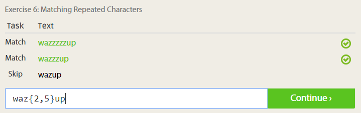

Based on https://github.com/rcos/CSCI-49XX-OpenSource/blob/master/Labs/Lab1.md

## Smart questions
Better ways to answer questions: Don't just tell them how to do it, explain why, so they learn. Don't be afraid to admit you don't know the answer.

## Free Culture
I think this chapter demonstrates how laws designed for physical systems often don't translate to digital ones. It also shows how malicious actors like the RIAA can abuse this. They can use extreme demands to get their way, and make an example of people without a lot of power to fight them. Though this case is from 2002, it presages many of the piracy cases that came after it. Are people who host a network responsible for the content users put on it? What if they don't host the content, only point to it?

Also this got the Weird Al track "Don't Download This Song" stuck in my head:

> Oh, you don't want to mess with the R-I-double-A  
They'll sue you if you burn that CD-R  
It doesn't matter if you're a grandma or a seven-year-old girl  
They'll treat you like the evil, hard bitten, criminal scum you are

## Using tree

## Regex
  
  
  
  
  
  
  
  

## Blockly

